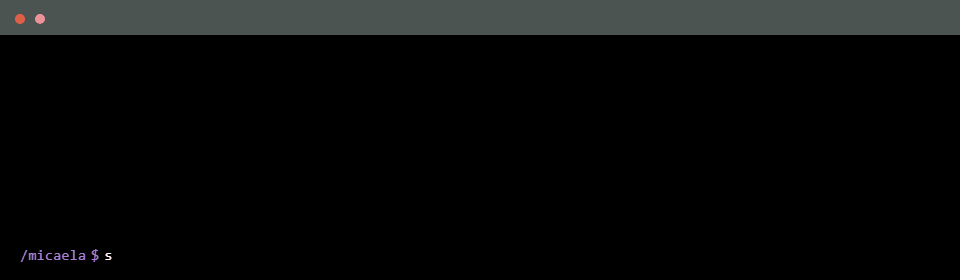

<!--
  Hi darling, this is my about me code, have a look!
 
-->

  

## Hello, I'm Mica ୭ 🧷 ✧ ˚. ᵎᵎ 🌷͙

ֶָ֢- I'm a **Video Game Programming Student** | **Designer**  
ֶָ֢- About me : A student of the craft with a background in industrial design, learning to code for the fun and creativity it unlocks as I'm a gemini venus after all  
ֶָ֢- Currently **Developing my skills in quality assurance and software testing**

  
<!--
     I wish this profile looked more complete (and you might ask, "complete how?" who knows anymore), but the truth is I
     only started this journey this year.
     I'm not rushing the process, and I might (or might not) have started heavily on learning as much as I could
     as you can see, looking forward to help out and to contribute to this universe and also looking forward to make
     mistakes again and again.
     
-->

## Main Skills

## Studying

 

<!--
     Thanks for being my guest and reading <3 
     And remember: "Just because it's not on your own doorstep doesn't make it right, we gotta make it right" yes you and I.
-->
